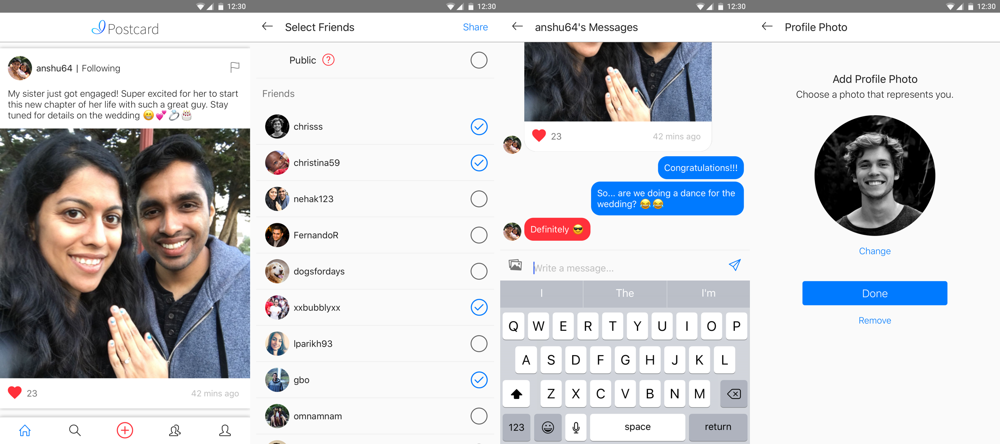

# Postcard
Postcard is a social platform and messenger that encourages you to keep in touch with your friends and family.

* Create a profile with a username and photo
* Share posts directly with friends or make them public
* Like posts to find them later and show others they've been heard
* Follow people who you want to hear more about
* Message your friends directly in private chat

Postcard was developed for Android & iOS in 2018 by Anshuman Dewangan and Vinit Parikh. The code is free for everyone to view, reuse, and evolve. If you do use the code in your own projects, attribution to Anshuman & Vinit would be appreciated. 



# postcard-mobile
Repository for Postcard's Android & iOS front-end using React Native. **Also see [postcard-api](https://github.com/anshuman64/postcard-api).**

## Setup
### Setup - General
1. Clone repository
````
git clone https://github.com/anshuman64/insiya-mobile.git
cd insiya-mobile
````

2. Install modules
````
npm install
````

3. Fix mime-types module
````
open ./node_modules/mime-types/index.js
````
Edit ````var extname = require('path').extname```` to:
````
const extname = (path) => {
   if (!path || path.indexOf('.') === -1) { return '' }
   path = '.' + path.split('.').pop().toLowerCase()
   return /.*(\..*)/g.exec(path)[1] || ''
}
````

4. Fix react-native-video-player
````
open ./node_modules/react-native-video-player/index.js
````
Replace contents with this file: https://drive.google.com/file/d/1-99De6dgEY4WnHhBvfqVrp5ktRA5a6wg/view?usp=sharing

5. Fix react-native-link-preview
````
open ./node_modules/react-native-link-preview/index.js
````
Replace contents with this file: https://drive.google.com/open?id=1mQ4ygwP4ooXTSMyujj7ZbuEBgSO_HA9m

### Setup - Android
1. Add insiya-android-certified.jks (ask anshuman64 for file) to /android/app directory

### Setup - iOS
0. Fix react-native-image-crop-picker UI
````
open ./node_modules/react-native-image-crop-picker/ios/RSKImageCropper/RSKImageCropper/RSKImageCropViewController.m
````
Change lines 335 and 359 (approximately) to:
````
//line 335:
_moveAndScaleLabel.text = RSKLocalizedString(@"", @"Move and Scale label");

//line 359:
[_chooseButton setTitle:RSKLocalizedString(@"Done", @"Choose button") forState:UIControlStateNormal];
````
NOTE: If you forget to do this step before installing pods below, also make the same changes in ````./ios/Pods/RSKImageCropper/RSKImageCropper/RSKImageCropViewController.m````

1. Install Pods
````
cd ios && pod install && cd ..
````

2. Fix search header for RCTBridgeModule.h
````
open ./node_modules/react-native/React/Base/RCTBridgeModule.h
````
Edit ````#import <React/RCTDefines.h>```` to ````#import "RCTDefines.h" ````

3. Open XCode application
4. ````File > Open > $INSIYA-MOBILE/ios````
5. Click on "Pods" in left panel
6. Select react-native-amplitude-analytics from the dropdown at the top
7. Click on "Header Search Paths"
8. Add ````"$(PODS_ROOT)/../../node_modules/react-native/React/"````
9. Set as "Recursive"


## Release
### Release - General
1. Comment all logging "console.", "debugger", and "Debug Test" lines
2. ENV_SETTING = ENV_TYPES.PRODUCTION in app_config.js
3. LoadingScreen inital={true} in App.js
4. Run the app on iOS simulator with these settings and log in with your phone number. Make sure everything works.

### CodePush Release
0. Make sure you follow the steps under "Release - General"!
1. Android
````
appcenter codepush release-react -a Insiya/Postcard-Android -d Production
````

2. iOS
````
appcenter codepush release-react -a Insiya/Postcard-iOS -d Production
````
Note: Add option ````---mandatory```` if the update should cause the app to refresh on start

### Full Release - Android
0. Make sure you follow the steps under "Release - General"!
1. Increment versionCode and versionName in android > app > build.gradle
2. Generate signed release APK
````
cd android && ./gradlew assembleRelease && cd ..
````
3. Search for "app-release.apk" in ````insiya-mobile/android/app/build/outputs/apk/release/app-release.apk```` and drag into Google Play Console

Note: If you want to test the signed release APK, run ````react-native run-android --variant=release````

### Full Release - iOS
0. Make sure you follow the steps under "Release - General"!
1. Increment Version and Build in XCode
2. Set build target to "Generic iOS Device"
3. Run ````Product > Archive````

### Post-Release
1. Assuming you were on "master" branch:
````
git checkout stable
git merge master
git tag vX.Y.Z
git push
git push origin vX.Y.Z
git checkout master
````

## Other Stuff
### Definitions
1. convo: a user or group (referring to conversations on the FriendScreen)
2. entity: a user, group, or contact
3. entityId: the id of a user (positive int), group (negative int), or contact phone number (string)
3. usersCache indices run from [1,infinity) and groupsCache indices run from (-infinity, -1]. If the object is a group, its index should be negative.

### Do's and Dont's
1. Read comments titled "WARNING". They are there for a reason.

### Change CodePush Deployment Keys
1. Android
````
open ./android/app/src/res/values/strings.xml
````
Change "reactNativeCodePush_androidDeploymentKey" from Staging ````wQznyJIRxUTXo2p5b0GAhdQuklSKHJZqy5gRG```` to Production ````#####################````

2. iOS

````
open ./ios/Insiya/Info.plist
````
Change "CodePushDeploymentKey" from Staging ````Z4GhodCyEHaA8swmU9dEUS38zI0_HJgxhKlCM```` to Production ````#####################````
